# EduSchedule Pro - Application Flows (AI-Optimized)

**Version:** 3.2
**Format:** Mermaid + Structured YAML
**Purpose:** Machine-readable flow definitions for AI agent training and reference
**Total Flows:** 40
**Coverage:** Complete coverage of application-flows.md v2.1 (consolidated)

---

## Maintenance Instructions

> **IMPORTANT:** This is the master flow document for AI agents. Keep it updated!

### When to Update This Document

| Scenario | Action Required |
|----------|-----------------|
| New flow implemented | Add new F0XX section with YAML + Mermaid |
| Flow logic changed | Update the affected flow's diagram and transitions |
| New business rule added | Add to Quick Reference → Key Business Rules |
| Status changed | Update flow_id status field (planned → implemented) |
| New exception type | Add to Exception Types Reference table |

### How to Add a New Flow

```yaml
## F0XX: [Flow Name]

flow_id: F0XX_flow_name
version: 1.0
status: planned | implemented
category: core | auth | approval | automation | scheduling | integration | optimization | playbook | crisis | gamification
actors: [admin, teacher, parent, system]
trigger: what_starts_this_flow

description: |
  Clear description of what this flow does.

key_rules:
  - rule_1
  - rule_2
```

Then add:
1. Mermaid diagram (stateDiagram-v2, flowchart, or sequenceDiagram)
2. Transitions table (if state machine)
3. Error handling (if applicable)
4. Update Flow Index table at top of document

### Related Files

| File | Purpose | Sync Status |
|------|---------|-------------|
| `application-flows.md` | Original ASCII version | Reference only (deprecated) |
| `/flows` page | Portuguese visual version | Update if major flows change |
| `docs/index.md` | Documentation index | Links to this document |

---

## Document Structure

Each flow follows this structure:
1. **Metadata Block** (YAML) - Machine-parseable flow properties
2. **State Diagram** (Mermaid) - Visual state machine
3. **Transitions Table** - All valid state transitions
4. **Error Handling** - Recovery strategies

---

## Flow Index

### Core Flows

| ID | Flow Name | Status | Category |
|----|-----------|--------|----------|
| F001 | Enrollment Lifecycle | implemented | core |
| F002 | Lead Pipeline | implemented | core |
| F003 | Class Instance | implemented | core |
| F004 | Schedule Generation | implemented | core |
| F005 | Slot Computation | implemented | core |
| F020 | Data Authority Hierarchy | implemented | core |
| F031 | Enrollment Creation | implemented | core |

### Auth & Security Flows

| ID | Flow Name | Status | Category |
|----|-----------|--------|----------|
| F006 | Authentication | implemented | auth |
| F007 | Session Management | implemented | auth |
| F021 | API Security Layers | implemented | security |
| F022 | RBAC Permissions | implemented | security |

### Approval Flows

| ID | Flow Name | Status | Category |
|----|-----------|--------|----------|
| F008 | Teacher Cancellation Approval | implemented | approval |
| F009 | Parent Cancellation | implemented | approval |
| F032 | Admin Bulk Approval | planned | approval |

### Automation Flows

| ID | Flow Name | Status | Category |
|----|-----------|--------|----------|
| F010 | PAUSADO Automation | implemented | automation |
| F011 | AVISO Countdown | planned | automation |
| F023 | FÉRIAS Tag System | implemented | automation |

### Scheduling Flows

| ID | Flow Name | Status | Category |
|----|-----------|--------|----------|
| F014 | System Closure | planned | scheduling |
| F016 | Reschedule Slot Picker | planned | scheduling |
| F024 | Slot Reservation (Concurrency) | planned | scheduling |
| F033 | Makeup Class Tracking | planned | scheduling |

### Integration Flows

| ID | Flow Name | Status | Category |
|----|-----------|--------|----------|
| F012 | Calendar Sync | implemented | integration |
| F013 | Change Request | implemented | user-management |
| F015 | Notification Delivery | planned | notification |

### Optimization Flows

| ID | Flow Name | Status | Category |
|----|-----------|--------|----------|
| F017 | AI Schedule Optimizer | planned | optimization |
| F018 | Zone Travel Matrix | planned | optimization |
| F034 | BookingGrid Component | planned | optimization |
| F035 | Teacher Request System | planned | optimization |
| F036 | Travel Time Engine | planned | optimization |
| F037 | Relocation Impact | planned | optimization |

### Business Playbook Flows

| ID | Flow Name | Status | Category |
|----|-----------|--------|----------|
| F025 | New Client Onboarding | implemented | playbook |
| F026 | Daily Operations | implemented | playbook |
| F027 | Monthly Billing | implemented | playbook |

### Crisis Management Flows

| ID | Flow Name | Status | Category |
|----|-----------|--------|----------|
| F028 | Crisis Triage | implemented | crisis |
| F029 | Communication Rules | implemented | crisis |
| F030 | Cascade Impact Prevention | implemented | crisis |

### Gamification Flows

| ID | Flow Name | Status | Category |
|----|-----------|--------|----------|
| F019 | Teacher Credit System | planned | gamification |

### Additional Detail Flows

| ID | Flow Name | Status | Category |
|----|-----------|--------|----------|
| F038 | Class Completion | implemented | core |
| F039 | Enhanced PAUSADO Notifications | planned | automation |
| F040 | Parent Reschedule Option | planned | scheduling |

> **Note:** F041-F043 (Token Refresh, Retry Strategy, Race Condition Prevention) are now subsections of F012 (Calendar Sync). F044-F045 (Teacher/Parent Self-Service) are now subsections of F013 (Change Request).

---

## F001: Enrollment Lifecycle

```yaml
flow_id: F001_enrollment_lifecycle
version: 1.0
status: implemented
category: core
actors: [admin, parent, system]
trigger: admin_creates_enrollment

description: |
  Manages the complete lifecycle of a student enrollment from creation
  through various states to termination. Controls slot blocking behavior.

business_rules:
  - ATIVO and PAUSADO both block slots
  - Only INATIVO releases a slot
  - PAUSADO has 3-week maximum duration
  - 5-month cooldown after PAUSADO auto-return
  - AVISO has 15-day countdown (no extensions)
```

```mermaid
stateDiagram-v2
    [*] --> WAITLIST: enrollment_created

    WAITLIST --> ATIVO: admin_approves
    WAITLIST --> INATIVO: admin_rejects

    ATIVO --> PAUSADO: parent_requests_pause
    ATIVO --> AVISO: formal_notice_given
    ATIVO --> INATIVO: immediate_termination

    PAUSADO --> ATIVO: pause_ends_or_auto_return
    PAUSADO --> INATIVO: admin_terminates

    AVISO --> ATIVO: notice_cancelled
    AVISO --> INATIVO: day_16_reached

    INATIVO --> [*]

    note right of WAITLIST: Slot: LIVRE
    note right of ATIVO: Slot: BLOCKED
    note right of PAUSADO: Slot: BLOCKED (held)
    note right of AVISO: Slot: BLOCKED (countdown)
    note right of INATIVO: Slot: LIVRE (released)
```

### Transitions

| From | To | Trigger | Conditions | Actions |
|------|-----|---------|------------|---------|
| WAITLIST | ATIVO | admin_approves | teacher_available, schedule_confirmed | create_classes, notify_parties, block_slot |
| WAITLIST | INATIVO | admin_rejects | rejection_reason | notify_parent, log_rejection |
| ATIVO | PAUSADO | parent_requests_pause | not_in_cooldown, reason_provided | set_pause_dates, hold_slot |
| ATIVO | AVISO | formal_notice_given | ceo_confirmed | set_aviso_end_date, start_countdown |
| ATIVO | INATIVO | immediate_termination | admin_action | release_slot, notify_waitlist |
| PAUSADO | ATIVO | auto_return | 21_days_elapsed | set_cooldown, log_return |
| PAUSADO | INATIVO | admin_terminates | admin_action | release_slot, notify_waitlist |
| AVISO | ATIVO | notice_cancelled | ceo_confirms_reversal | clear_aviso_dates |
| AVISO | INATIVO | day_16_reached | countdown_complete | release_slot, notify_waitlist |

### Error Handling

| Error | State | Recovery |
|-------|-------|----------|
| pause_during_cooldown | ATIVO | reject_request, show_cooldown_remaining |
| double_pause_request | PAUSADO | reject_request, show_current_pause |
| invalid_aviso_reversal | AVISO | require_ceo_confirmation |

---

## F002: Lead Pipeline

```yaml
flow_id: F002_lead_pipeline
version: 1.0
status: implemented
category: core
actors: [parent, admin, system]
trigger: parent_submits_registration

description: |
  Handles incoming leads from registration to conversion or rejection.
  Includes teacher matching algorithm.

matching_algorithm:
  availability_match: 20_points_per_slot
  location_proximity: 30_points_same_neighborhood
  language_match: 50_points_teaches_language
```


### Transitions

| From | To | Trigger | Conditions | Actions |
|------|-----|---------|------------|---------|
| AGUARDANDO | EM_ANALISE | admin_reviews | - | start_analysis |
| AGUARDANDO | NOT_A_MATCH | admin_rejects | location_not_served | notify_parent |
| EM_ANALISE | WAITLIST | no_availability | teachers_matched_but_full | add_to_waitlist, set_priority |
| EM_ANALISE | CONTRACTED | teacher_matched | availability_confirmed | create_student, create_enrollment |
| WAITLIST | CONTRACTED | availability_opens | slot_released | auto_notify, convert_lead |

---

## F003: Class Instance Lifecycle

```yaml
flow_id: F003_class_instance
version: 1.0
status: implemented
category: core
actors: [teacher, parent, admin, system]
trigger: scheduled_class_date_reached

description: |
  Tracks individual class instances from scheduled through completion
  or cancellation. Determines billing status.

billing_rules:
  COMPLETED: billable
  NO_SHOW: billable
  CANCELLED_STUDENT: not_billable
  CANCELLED_TEACHER: not_billable
```


### Transitions

| From | To | Trigger | Conditions | Actions |
|------|-----|---------|------------|---------|
| SCHEDULED | COMPLETED | teacher_marks_complete | class_date_passed | create_completion, billable=true |
| SCHEDULED | NO_SHOW | teacher_marks_absent | class_date_passed | create_completion, billable=true |
| SCHEDULED | CANCELLED_STUDENT | parent_cancels | min_2_hours_notice | create_exception, notify_teacher |
| SCHEDULED | CANCELLED_TEACHER | teacher_cancels_approved | admin_approved | create_exception, notify_parent |
| SCHEDULED | CLOSURE | system_closure_applies | date_in_closure_range | mark_closure, no_billing |

---

## F004: Schedule Generation

```yaml
flow_id: F004_schedule_generation
version: 1.0
status: implemented
category: core
actors: [system]
trigger: api_request_for_schedule

description: |
  Generates weekly schedule by combining enrollments with exceptions,
  completions, and system closures. Returns computed view.

priority_order:
  1: system_closure
  2: individual_exception
  3: completion_record
  4: enrollment_status
  5: default_scheduled
```


### Status Priority

| Priority | Check | Result Status |
|----------|-------|---------------|
| 1 | date_in_system_closures | CLOSURE |
| 2 | exception_exists | exception.type |
| 3 | completion_exists | COMPLETED or NO_SHOW |
| 4 | enrollment.status == PAUSADO | PAUSADO |
| 5 | default | SCHEDULED |

---

## F005: Slot Computation

```yaml
flow_id: F005_slot_computation
version: 1.0
status: implemented
category: core
actors: [system]
trigger: slot_status_query

description: |
  Computes slot availability on-demand. Slots are NOT stored -
  they are derived from enrollment state.

key_rule: |
  PAUSADO enrollments BLOCK slots. Slot is held for student return.
  Only INATIVO releases a slot for new bookings.
```


### Slot Status Rules

| Enrollment Status | Slot Status | Reason |
|-------------------|-------------|--------|
| none | LIVRE | No enrollment for this slot |
| ATIVO | BLOCKED | Active student occupies slot |
| PAUSADO | BLOCKED | Slot held for student return |
| INATIVO | LIVRE | Terminated, slot released |
| WAITLIST | LIVRE | Pending, not yet blocking |

---

## F006: Authentication Flow

```yaml
flow_id: F006_authentication
version: 1.0
status: implemented
category: auth
actors: [user, system, google]
trigger: user_clicks_login

description: |
  OAuth 2.0 + PKCE flow with Google. Creates encrypted session
  cookie and routes user by role.

security:
  pkce: true
  encryption: AES-256-GCM
  session_storage: [encrypted_cookie, d1_sessions_table]
```


### Role Routing

| Role | Redirect To | Permissions |
|------|-------------|-------------|
| admin | /admin | full_access |
| teacher | /teacher | own_enrollments, completions |
| parent | /parent | children_only, view_mostly |

---

## F007: Session Management

```yaml
flow_id: F007_session_management
version: 1.0
status: implemented
category: auth
actors: [system]
trigger: every_request

description: |
  Validates and manages user sessions on each request.
  Sessions stored encrypted in cookie and D1.
```


---

## F008: Teacher Cancellation Approval

```yaml
flow_id: F008_teacher_cancellation_approval
version: 1.0
status: implemented
category: approval
actors: [teacher, admin, system]
trigger: teacher_requests_cancellation

description: |
  Teacher cancellation requests require admin approval.
  Sick cancellations have special protection (no credit penalty).

sick_protection:
  credit_penalty: none
  approval_priority: high
  message: "Health comes first. No penalty for sick days."
```


### Exception Record

```yaml
exception_record:
  id: "exc_xxx"
  enrollment_id: "enr_xxx"
  exception_date: "2025-01-06"
  exception_type: "CANCELLED_TEACHER"
  reason: "sick" | "personal" | "other"
  is_sick_protected: boolean
  approved_by: null | "admin_id"
  approved_at: null | timestamp
  status: "pending" | "approved" | "rejected"
```

---

## F009: Parent Cancellation

```yaml
flow_id: F009_parent_cancellation
version: 1.0
status: implemented
category: approval
actors: [parent, system, teacher]
trigger: parent_clicks_cancel

description: |
  Parent cancellations are auto-approved. No admin intervention needed.
  Creates exception and notifies teacher.

constraints:
  min_notice: 2_hours
  approval: automatic
  billing: not_billable
```


---

## F010: PAUSADO Automation

```yaml
flow_id: F010_pausado_automation
version: 1.0
status: implemented
category: automation
actors: [system]
trigger: enrollment_access

description: |
  Lazy evaluation of PAUSADO status. Auto-returns to ATIVO
  after 21 days. Sets 5-month cooldown.

timing:
  max_pause_duration: 21_days
  cooldown_after_return: 5_months
  evaluation: lazy_on_access
```


---

## F011: AVISO Countdown

```yaml
flow_id: F011_aviso_countdown
version: 1.0
status: planned
category: automation
actors: [admin, parent, system]
trigger: formal_notice_given

description: |
  15-day notice period before termination. Classes continue,
  billing continues. Can be reversed with CEO confirmation.

rules:
  countdown_days: 15
  can_reverse: true_with_ceo_confirmation
  billing_during_aviso: continues
  timers_during_ferias: continue_counting
```

```mermaid
stateDiagram-v2
    [*] --> AVISO_ACTIVE: formal_notice_given

    AVISO_ACTIVE --> AVISO_REVERSED: ceo_cancels_aviso
    AVISO_ACTIVE --> INATIVO: day_16_reached

    AVISO_REVERSED --> ATIVO
    INATIVO --> [*]

    note right of AVISO_ACTIVE: Days 1-15: Can reverse
    note right of INATIVO: Day 16: Auto-terminate
```

---

## F012: Calendar Sync

```yaml
flow_id: F012_calendar_sync
version: 1.0
status: implemented
category: integration
actors: [system]
trigger: enrollment_change

description: |
  Queue-based sync from D1 to Google Calendar. D1 is source of truth.
  Calendar is display layer only.

principles:
  source_of_truth: d1_database
  sync_direction: one_way_to_calendar
  consistency: eventual
  degradation: graceful_if_api_fails

retry_strategy:
  attempt_1: 1_minute
  attempt_2: 5_minutes
  attempt_3: 30_minutes
  max_attempts: 3
```


### Sync Queue Entry

```yaml
sync_queue_entry:
  id: "sq_xxx"
  operation: "create" | "update" | "delete"
  entity_type: "availability" | "booking"
  entity_id: "avl_xxx"
  status: "pending" | "processing" | "completed" | "failed"
  attempts: 0
  max_attempts: 3
  last_error: null | "error_message"
  next_retry_at: timestamp
```

### Token Refresh Wrapper

Automatic token refresh on 401/403 errors. Wraps all Google Calendar API calls.

```yaml
token_refresh:
  retry_on: [401, 403]
  max_retries: 1
  fallback: user_reauth
```


### Retry Strategy (Exponential Backoff)


### Race Condition Prevention

Calendar-first, DB-second pattern to prevent race conditions.

| Order | Wrong | Correct |
|-------|-------|---------|
| Step 1 | Update DB | Create calendar events |
| Step 2 | Create calendar | If success: Update DB |
| Result | Race condition! | No race condition |


---

## F013: Change Request Workflow

```yaml
flow_id: F013_change_request
version: 1.0
status: implemented
category: user-management
actors: [teacher, parent, admin]
trigger: user_requests_profile_change

description: |
  Self-service profile changes require admin approval.
  Teachers and parents can request changes; admins review.

permissions:
  admin_create: no_approval_needed
  teacher_change: approval_required
  parent_change: approval_required
```


### Change Request Record

```yaml
change_request_record:
  id: "cr_xxx"
  request_type: "teacher" | "student"
  resource_id: "teacher_xxx" | "student_xxx"
  requester_id: "user_xxx"
  requester_email: "email@example.com"
  old_values:
    email: "old@example.com"
    phone: "+55 48 98765-4321"
  new_values:
    email: "new@example.com"
    phone: "+55 48 99999-8888"
  status: "pending" | "approved" | "rejected"
  reviewed_by: null | "admin_id"
  reviewed_at: null | timestamp
  reason: null | "rejection_reason"
```

### Teacher Profile Self-Service (/teacher/profile)

Teachers can view their profile and request changes. All changes require admin approval.

**Viewable fields:** name, email, phone, address (decrypted), CPF (decrypted), languages, availability

```mermaid
sequenceDiagram
    participant T as Teacher
    participant A as App
    participant DB as D1 Database
    participant AD as Admin

    T->>A: Navigate to /teacher/profile
    A->>DB: Load teacher data
    DB->>A: Return profile (decrypt PII)
    A->>T: Display profile + pending requests

    T->>A: Click "Request Changes"
    A->>T: Show change modal

    T->>A: Enter new values
    A->>DB: Create change request (pending)
    A->>T: "Request submitted for review"
    A->>AD: Add to approval queue

    Note over T: Shows status badges
    Note over T: 🟡 Pending | 🟢 Approved | 🔴 Rejected
```



### Parent Student Management (/parent/students)

Parents can view and request changes to their children's profiles.

**Authorization:** `student.parent_email === session.user.email` (403 if mismatch)


---

## F014: System Closure

```yaml
flow_id: F014_system_closure
version: 1.0
status: planned
category: scheduling
actors: [admin, system]
trigger: admin_creates_closure

description: |
  System-wide or city-specific closures for weather, holidays,
  or emergencies. Affects all enrollments in target area.

closure_types:
  - FERIAS
  - WEATHER
  - EMERGENCY
  - HOLIDAY
  - CUSTOM

targeting:
  - all_cities
  - specific_city
  - specific_neighborhood (future)
```

```mermaid
sequenceDiagram
    participant AD as Admin
    participant A as App
    participant DB as D1 Database
    participant N as Notification Service

    AD->>A: Create closure (type, city, dates, reason)
    A->>DB: Insert system_closure record
    A->>DB: Query affected enrollments

    loop For Each Affected Enrollment
        A->>DB: Mark classes as CLOSURE for dates
    end

    A->>N: Queue bulk notifications
    N->>N: Notify all affected parents
    N->>N: Notify all affected teachers

    A->>AD: Show "Closure created, X families notified"
```

### System Closure Record

```yaml
system_closure_record:
  id: "sc_xxx"
  closure_type: "WEATHER" | "FERIAS" | "EMERGENCY" | "HOLIDAY" | "CUSTOM"
  city_id: null | "city_xxx"  # null = all cities
  start_date: "2025-01-10"
  end_date: "2025-01-10"
  reason: "Storm warning - heavy rain expected"
  notify_parents: true
  notify_teachers: true
  created_by: "admin_xxx"
  created_at: timestamp
```

---

## F015: Notification Delivery

```yaml
flow_id: F015_notification_delivery
version: 1.0
status: planned
category: notification
actors: [system]
trigger: notification_event

description: |
  In-app notification system. WhatsApp and email planned for later phases.

channels:
  phase_1: in_app
  phase_2: whatsapp
  phase_3: email_fallback

notification_types:
  - CLASS_CANCELLED_BY_PARENT
  - CLASS_CANCELLED_BY_TEACHER
  - CLASS_CANCELLED_BY_ADMIN
  - CLASS_CANCELLED_WEATHER
  - CLASS_RESCHEDULED
  - CANCELLATION_APPROVED
  - CANCELLATION_REJECTED
  - PAUSADO_ENDING_SOON
  - AVISO_COUNTDOWN
```

```mermaid
flowchart TD
    A[Event Occurs] --> B[Notification Service]
    B --> C[Determine Recipients]
    C --> D[Create Notification Records]

    D --> E{Delivery Channel}
    E -->|in_app| F[Insert to notifications table]
    E -->|whatsapp| G[Queue WhatsApp message]
    E -->|email| H[Queue email]

    F --> I[Update bell icon count]
    G --> J[Business API delivery]
    H --> K[Email service delivery]
```

### Notification Record

```yaml
notification_record:
  id: "ntf_xxx"
  user_id: "usr_xxx"
  notification_type: "CLASS_CANCELLED_WEATHER"
  title: "Class Cancelled"
  message: "Your Monday 15:00 class has been cancelled due to weather"
  link: "/parent/schedule"
  is_read: false
  created_at: timestamp
  read_at: null | timestamp
```

### Real-Time Notification Triggers

| Event | Recipient | Message |
|-------|-----------|---------|
| **Parent cancels** | Teacher | "[Student] cancelled their class on [Date]" |
| **Parent cancels** | Admin | Activity feed entry |
| **Teacher cancels (approved)** | Parent | "Your class on [Date] has been cancelled. [Reason]. Contact us to reschedule" |
| **Admin cancels** | Parent | "Your class on [Date] has been cancelled. [Reason]" |
| **Admin cancels** | Teacher | "[Student]'s class on [Date] has been cancelled" |
| **Weather/System closure** | All affected parents | "Classes cancelled on [Date] due to [Reason]" |
| **Weather/System closure** | All affected teachers | "Your classes on [Date] are cancelled due to [Reason]" |
| **PAUSADO Day 18** | Parent | "Your pause ends in 3 days" |
| **AVISO started** | Parent | "Notice period started - 15 days remaining" |
| **Cancellation approved** | Teacher | "Your cancellation request was approved" |
| **Cancellation rejected** | Teacher | "Cancellation not approved - please contact admin" |

---

## F016: Reschedule Slot Picker

```yaml
flow_id: F016_reschedule_slot_picker
version: 1.0
status: planned
category: scheduling
actors: [admin, parent]
trigger: class_cancelled_needs_makeup

description: |
  Smart slot picker that suggests available makeup slots
  prioritized by proximity to original time.

slot_sources:
  - teacher_livre_slots_this_week
  - teacher_livre_slots_next_week
  - cancelled_slots_from_other_students

sorting: proximity_to_original_time
```

```mermaid
flowchart TD
    A[Class Cancelled] --> B[Show Needs Makeup]
    B --> C[User Clicks Reschedule]

    C --> D[Query Teacher LIVRE Slots]
    D --> E[Query This Week]
    D --> F[Query Next Week]
    D --> G[Query Available Cancellations]

    E --> H[Sort by Proximity]
    F --> H
    G --> H

    H --> I[Display Options]
    I --> J{User Selects Slot}

    J --> K[Create Exception for Original]
    K --> L[Create Makeup Class Entry]
    L --> M[Link Makeup to Original]
    M --> N[Notify Both Parties]
```

---

## F017: AI Schedule Optimizer

```yaml
flow_id: F017_ai_schedule_optimizer
version: 1.0
status: planned
category: optimization
actors: [admin, system]
trigger: reschedule_or_new_booking

description: |
  AI-powered slot suggestions based on route optimization,
  location clustering, and parent preferences.

scoring_factors:
  same_day_as_other_classes: 10_points
  same_zone_neighborhood: 5_points
  adjacent_to_existing_route: 8_points
  parent_preferred_times: 3_points
  same_time_as_cancelled: 2_points
  no_conflict_impact: 5_points
```

```mermaid
flowchart TD
    A[Request for Booking] --> B[Gather Context]
    B --> C[Teacher Schedule]
    B --> D[Student Location]
    B --> E[Parent Preferences]
    B --> F[Existing Routes]

    C --> G[Find LIVRE Slots]
    G --> H[Score Each Slot]

    H --> I{Calculate Score}
    I --> J[Same day bonus: +10]
    I --> K[Same zone: +5]
    I --> L[Route synergy: +8]
    I --> M[Preferred time: +3]

    J --> N[Sort by Score]
    K --> N
    L --> N
    M --> N

    N --> O[Return Top 5 Suggestions]
    O --> P[Display with Explanations]
```

---

## F018: Zone Travel Matrix

```yaml
flow_id: F018_zone_travel_matrix
version: 1.0
status: planned
category: optimization
actors: [system]
trigger: travel_time_query

description: |
  Pre-calculated zone-to-zone travel times to minimize
  Google API costs. Zones divide city into ~25-30 areas.

lookup_strategy:
  level_1: database_lookup (FREE)
  level_2: zone_matrix (FREE)
  level_3: geocoding ($5/1000)
  level_4: distance_matrix_api ($10/1000)

buffer_times:
  same_zone: 5_minutes
  adjacent_zones: 15_minutes
  different_zones: 25-30_minutes
```

```mermaid
flowchart TD
    A[New Booking Request] --> B[Step 1: Zone Lookup]
    B --> C[Find Student Zone]
    B --> D[Find Teacher Location Zone]

    C --> E[Step 2: Matrix Check]
    D --> E

    E --> F[Lookup zone_travel_matrix]
    F --> G[Get avg_travel_mins]

    G --> H[Step 3: Feasibility Check]
    H --> I{gap >= travel + buffer?}

    I -->|Yes| J[FEASIBLE]
    I -->|No| K[NOT FEASIBLE]

    J --> L[Step 4: Final Verify]
    L --> M[API call for confirmation]

    K --> N[Show Warning]
    N --> O[Suggest Alternatives]
```

---

## F019: Teacher Credit System

```yaml
flow_id: F019_teacher_credit_system
version: 1.0
status: planned
category: gamification
actors: [teacher, system]
trigger: various_actions

description: |
  Gamification system for teacher quality and reliability.
  Credits determine pay tier. Sick days are protected.

tiers:
  bronze:
    credits: 0-149
    pay_per_class: 79
  silver:
    credits: 150-299
    pay_per_class: 87
  gold:
    credits: 300-599
    pay_per_class: 91
  platinum:
    credits: 600+
    pay_per_class: 95

credit_earning:
  sign_contract: +100
  complete_class: +1
  complete_report_card: +10
  perfect_week: +5
  five_star_rating: +3
  accept_difficult_schedule: +2

credit_losing:
  sick_verified: 0  # PROTECTED
  cancel_same_day_not_sick: -15
  late_arrival_10min: -2
  no_show_without_notice: -20
  late_report_card: -5_per_week
```

```mermaid
stateDiagram-v2
    [*] --> Bronze: new_teacher

    Bronze --> Silver: credits_reach_150
    Silver --> Bronze: credits_drop_below_150

    Silver --> Gold: credits_reach_300
    Gold --> Silver: credits_drop_below_300

    Gold --> Platinum: credits_reach_600
    Platinum --> Gold: credits_drop_below_600
```

---

## F020: Data Authority Hierarchy

```yaml
flow_id: F020_data_authority_hierarchy
version: 1.0
status: implemented
category: core
actors: [system]
trigger: data_query

description: |
  Defines the source of truth hierarchy for all data in the system.
  D1 database is the master. Calendar is display-only mirror.

hierarchy:
  1: enrollments  # Recurring commitment definition
  2: exceptions   # Per-instance deviations
  3: completions  # Proof of delivery
  4: calendar     # Display layer only (one-way sync)

key_principle: |
  Calendar never writes back to database.
  System works even if calendar API fails.
```

```mermaid
flowchart TD
    subgraph "SOURCE OF TRUTH"
        A[Enrollments - D1] --> B[Exceptions - D1]
        B --> C[Completions - D1]
    end

    subgraph "DISPLAY LAYER"
        C --> D[Google Calendar]
    end

    E[User Action] --> A
    D -.->|"READ ONLY"| F[Teachers/Parents View]

    style A fill:#22c55e
    style B fill:#22c55e
    style C fill:#22c55e
    style D fill:#3b82f6
```

### Authority Rules

| Layer | Authority | Can Modify | Direction |
|-------|-----------|------------|-----------|
| Enrollments | PRIMARY | App only | Source |
| Exceptions | SECONDARY | App only | Overrides enrollments |
| Completions | TERTIARY | App only | Records delivery |
| Calendar | DISPLAY | App pushes | One-way mirror |

---

## F021: API Security Layers

```yaml
flow_id: F021_api_security_layers
version: 1.0
status: implemented
category: security
actors: [system]
trigger: every_api_request

description: |
  Multi-layer security for all API requests.
  Each layer must pass before request proceeds.

layers:
  1: rate_limiting
  2: session_validation
  3: csrf_check
  4: role_permission
  5: input_validation
  6: business_logic
```

```mermaid
flowchart TD
    A[Incoming Request] --> B{Rate Limit OK?}
    B -->|No| B1[429 Too Many Requests]
    B -->|Yes| C{Session Valid?}

    C -->|No| C1[401 Unauthorized]
    C -->|Yes| D{CSRF Valid?}

    D -->|No| D1[403 CSRF Invalid]
    D -->|Yes| E{Role Permitted?}

    E -->|No| E1[403 Forbidden]
    E -->|Yes| F{Input Valid?}

    F -->|No| F1[400 Validation Error]
    F -->|Yes| G[Service Layer]

    G --> H{Business Logic OK?}
    H -->|No| H1[409/422 Business Error]
    H -->|Yes| I[Repository Layer]

    I --> J[Audit Log]
    J --> K[200/201/204 Success]
```

### Error Responses

| Layer | Status | Code | Response |
|-------|--------|------|----------|
| Rate Limiting | 429 | RATE_LIMIT_EXCEEDED | Too Many Requests |
| Session | 401 | UNAUTHORIZED | Session expired or invalid |
| CSRF | 403 | CSRF_INVALID | CSRF token mismatch |
| Role | 403 | FORBIDDEN | Insufficient permissions |
| Validation | 400 | VALIDATION_ERROR | Invalid input data |
| Business | 409 | CONFLICT | Business rule violation |
| Business | 422 | UNPROCESSABLE | Cannot process request |

---

## F022: RBAC Permissions

```yaml
flow_id: F022_rbac_permissions
version: 1.0
status: implemented
category: security
actors: [admin, teacher, parent]
trigger: authorization_check

description: |
  Role-Based Access Control matrix defining what each role can do.
  Admin has full access. Teacher/Parent have scoped access.
```

```mermaid
flowchart LR
    subgraph ADMIN
        A1[All Enrollments CRUD]
        A2[All Leads CRUD]
        A3[All Teachers/Students]
        A4[System Closures]
        A5[Approval Queue]
        A6[Override Cooldowns]
    end

    subgraph TEACHER
        T1[Own Enrollments - Read]
        T2[Own Schedule - Read]
        T3[Own Slots - Read]
        T4[Mark Completions]
        T5[Request Cancellations]
        T6[Edit Notes - 7 day window]
    end

    subgraph PARENT
        P1[Children Enrollments - Read]
        P2[Children Schedule - Read]
        P3[Children History - Read]
        P4[Teacher Notes - Read]
        P5[Cancel Children Classes]
        P6[View Invoices]
    end
```

### Permission Matrix

| Resource | Admin | Teacher | Parent |
|----------|-------|---------|--------|
| enrollments:create | YES | NO | NO |
| enrollments:read | ALL | OWN | CHILDREN |
| enrollments:update | ALL | NO | NO |
| enrollments:delete | ALL | NO | NO |
| completions:create | YES | OWN | NO |
| completions:update | YES | OWN (7 days) | NO |
| exceptions:create | YES | REQUEST | OWN_CHILDREN |
| exceptions:approve | YES | NO | NO |
| closures:manage | YES | NO | NO |
| users:manage | YES | NO | NO |

---

## F023: FÉRIAS Tag System

```yaml
flow_id: F023_ferias_tag_system
version: 1.0
status: implemented
category: automation
actors: [admin, system]
trigger: date_in_ferias_range

description: |
  FÉRIAS is a TAG, not a status change. Enrollment stays ATIVO
  but no classes are generated during FÉRIAS period.
  All timers CONTINUE counting during FÉRIAS.

key_distinction: |
  WRONG: ATIVO → FÉRIAS → ATIVO (status changes)
  CORRECT: ATIVO + [FÉRIAS TAG] = Still ATIVO

timer_behavior:
  aviso_countdown: continues_during_ferias
  pausado_limit: continues_during_ferias
  company_operations: reduced_hours
```

```mermaid
flowchart TD
    A[Admin Sets FÉRIAS Dates] --> B[System Settings Updated]
    B --> C[ferias_start_date, ferias_end_date]

    D[Schedule Generator Runs] --> E{Date in FÉRIAS?}
    E -->|Yes| F[Skip Class Generation]
    E -->|No| G[Normal Class Generation]

    F --> H[Show FÉRIAS Indicator]
    G --> I[Show SCHEDULED Status]

    J[AVISO Countdown] --> K[Continues During FÉRIAS]
    L[PAUSADO Timer] --> M[Continues During FÉRIAS]

    style F fill:#eab308
    style K fill:#f97316
    style M fill:#f97316
```

### FÉRIAS Edge Cases

| Scenario | Behavior |
|----------|----------|
| Student in AVISO before FÉRIAS | Countdown CONTINUES, may terminate during break |
| Student in PAUSADO before FÉRIAS | 3-week timer CONTINUES counting |
| Teacher sick during FÉRIAS | No credit loss (no classes to miss) |
| New enrollment during FÉRIAS | Activates but classes start after FÉRIAS |

---

## F024: Slot Reservation (Concurrency)

```yaml
flow_id: F024_slot_reservation
version: 1.0
status: planned
category: scheduling
actors: [admin, system]
trigger: admin_clicks_livre_slot

description: |
  Movie theater-style slot reservation to prevent concurrent
  double-booking by multiple admins.

reservation_rules:
  duration: 10_minutes
  release: manual_or_timeout
  conflict_rule: first_click_wins
```

```mermaid
sequenceDiagram
    participant A1 as Admin 1
    participant A2 as Admin 2
    participant S as System
    participant DB as Database

    A1->>S: Click LIVRE slot
    S->>DB: Check reservation status

    alt Slot Available
        DB->>S: Not reserved
        S->>DB: Create reservation (10 min)
        S->>A1: Show "Reserved by Me"

        A2->>S: Click same slot
        S->>DB: Check reservation
        DB->>S: Reserved by Admin 1
        S->>A2: Show "Locked - Reserved by Admin 1 (X:XX remaining)"

        alt Admin 1 Books
            A1->>S: Confirm booking
            S->>DB: Create enrollment
            S->>DB: Clear reservation
        else Admin 1 Abandons
            A1->>S: Release slot
            S->>DB: Clear reservation
        else Timeout
            S->>DB: Auto-clear after 10 min
        end
    else Already Reserved
        DB->>S: Reserved by Admin 2
        S->>A1: Show "Locked"
    end
```

### Reservation States

| State | Duration | Next States |
|-------|----------|-------------|
| LIVRE | - | RESERVED |
| RESERVED | 10 minutes | BOOKED, LIVRE (released), LIVRE (timeout) |
| BOOKED | permanent | LIVRE (only via INATIVO) |

---

## F025: New Client Onboarding

```yaml
flow_id: F025_new_client_onboarding
version: 1.0
status: implemented
category: playbook
actors: [parent, admin, teacher]
trigger: parent_finds_bilin

description: |
  Business workflow from initial discovery through first class.
  6 steps from lead to contract extension.

steps:
  1: discovery
  2: availability_check
  3: teacher_matching
  4: conversion
  5: first_class
  6: contract_extension
```

```mermaid
flowchart TD
    A[Step 1: Discovery] --> B[Parent finds BILIN]
    B --> C[Parent fills JotForm]
    C --> D[Lead created - AGUARDANDO]

    D --> E[Step 2: Availability Check]
    E --> F{Can serve location?}
    F -->|No| G[Move to WAITLIST]
    F -->|Yes| H{Teacher available?}
    H -->|No| G
    H -->|Yes| I[Continue to Matching]

    I --> J[Step 3: Teacher Matching]
    J --> K[System suggests teachers]
    K --> L[Admin reviews]
    L --> M[Admin contacts parent]
    M --> N[Admin contacts teacher]

    N --> O[Step 4: Conversion]
    O --> P[Click Convert to Enrollment]
    P --> Q[Create student if new]
    Q --> R[Create enrollment - ATIVO]
    R --> S[Lead status → CONTRACTED]

    S --> T[Step 5: First Class]
    T --> U[Teacher teaches trial]
    U --> V[Teacher marks complete]
    V --> W[Parent sees notes]

    W --> X[Step 6: Contract Extension]
    X --> Y{After 1 month trial}
    Y --> Z1[6-month contract - 10% discount]
    Y --> Z2[Flexible ongoing]
```

---

## F026: Daily Operations

```yaml
flow_id: F026_daily_operations
version: 1.0
status: implemented
category: playbook
actors: [admin]
trigger: each_business_day

description: |
  Daily admin workflow for managing classes, cancellations,
  and scheduling issues.

schedule:
  morning_8am: check_approval_queue
  throughout_day: handle_requests
  evening_7pm: review_completions
```

```mermaid
flowchart TD
    subgraph "MORNING 8:00 AM"
        A1[Check pending approval queue]
        A2[Review overnight cancellations]
        A3[Process teacher cancellations]
        A4[Check scheduling conflicts]
    end

    subgraph "THROUGHOUT DAY"
        B1[Handle parent cancellations - auto]
        B2[Process new lead registrations]
        B3[Match leads to teachers]
        B4[Monitor teacher schedules]
    end

    subgraph "TEACHER ISSUES"
        C1[Teacher running late] --> C2[Notify parent via system]
        C3[Teacher sick] --> C4[Create CANCELLED_TEACHER exceptions]
        C4 --> C5[Auto-approve sick]
        C5 --> C6[Notify affected parents]
    end

    subgraph "END OF DAY 7:00 PM"
        D1[Review completed classes]
        D2[Check missing completion records]
        D3[Verify next day schedule]
    end
```

---

## F027: Monthly Billing

```yaml
flow_id: F027_monthly_billing
version: 1.0
status: implemented
category: playbook
actors: [admin, system]
trigger: end_of_month

description: |
  Invoice calculation based on completions.
  Only COMPLETED and NO_SHOW are billable.

billing_formula: |
  Total = (COMPLETED + NO_SHOW) × hourly_rate

teacher_earnings: |
  Earnings = (COMPLETED + NO_SHOW) × teacher_rate
```

```mermaid
flowchart TD
    A[Query class_completions for month] --> B[Count by status]

    B --> C[COMPLETED: billable]
    B --> D[NO_SHOW: billable]
    B --> E[CANCELLED_STUDENT: not billable]
    B --> F[CANCELLED_TEACHER: not billable]

    C --> G[Calculate Total]
    D --> G

    G --> H["Total = (COMPLETED + NO_SHOW) × rate"]

    H --> I[Parent Invoice]
    H --> J[Teacher Earnings]

    subgraph "Parent Invoice Example"
        I1[Classes Completed: 4]
        I2[No-Shows billable: 1]
        I3[Cancelled you: 1 - not billed]
        I4[Rate: R$ 150/class]
        I5[Total: R$ 750]
    end

    subgraph "Teacher Earnings Example"
        J1[Completed: 24 classes]
        J2[No-Shows: 2 classes]
        J3[Rate: R$ 95/class]
        J4[Earnings: R$ 2,470]
    end
```

### Billing Status Matrix

| Status | Billable | Reason |
|--------|----------|--------|
| COMPLETED | YES | Class delivered |
| NO_SHOW | YES | Teacher showed up |
| CANCELLED_STUDENT | NO | Parent cancelled |
| CANCELLED_TEACHER | NO | Teacher cancelled |
| CLOSURE | NO | System closure |

---

## F028: Crisis Triage

```yaml
flow_id: F028_crisis_triage
version: 1.0
status: implemented
category: crisis
actors: [admin]
trigger: crisis_event

description: |
  Priority order for handling crisis situations.
  Critical issues same-day, urgent within 48h, important this week.

priority_levels:
  critical: same_day
  urgent: within_48_hours
  important: this_week
```

```mermaid
flowchart TD
    subgraph "CRITICAL - Same Day"
        A1[Rebooking orphaned students]
        A2[Teacher sick with no substitute]
        A3[Teacher no-show]
        A4[Fix data bugs / double-bookings]
    end

    subgraph "URGENT - Within 48 Hours"
        B1[PAUSADO overdue - past 3 weeks]
        B2[AVISO completed - day 16+]
    end

    subgraph "IMPORTANT - This Week"
        C1[WAITLIST offers]
        C2[New slot available]
    end

    A1 --> A1A[Contact ALL affected parents immediately]
    A4 --> A4A[Resolve conflict, notify parties]
    B1 --> B1A[Admin decides: charge or release]
    B2 --> B2A[Transition to INATIVO, offer to waitlist]
    C1 --> C1A[Match families, send offers]

    style A1 fill:#ef4444
    style A2 fill:#ef4444
    style A3 fill:#ef4444
    style A4 fill:#ef4444
    style B1 fill:#eab308
    style B2 fill:#eab308
    style C1 fill:#22c55e
```

---

## F029: Communication Rules

```yaml
flow_id: F029_communication_rules
version: 1.0
status: implemented
category: crisis
actors: [teacher, parent, admin]
trigger: any_communication

description: |
  Teachers and parents should NOT communicate directly.
  All communication flows through admin/company.

rationale:
  - teacher_protection: no_9pm_messages
  - company_protection: no_side_deals
  - audit_trail: for_issues
  - contract_enforcement: guaranteed
```

```mermaid
flowchart LR
    subgraph "WRONG"
        W1[Teacher] <-->|"Direct (NO!)"| W2[Parent]
    end

    subgraph "CORRECT"
        C1[Teacher] <--> C2[Admin/Company] <--> C3[Parent]
    end

    style W1 fill:#ef4444
    style W2 fill:#ef4444
    style C1 fill:#22c55e
    style C2 fill:#22c55e
    style C3 fill:#22c55e
```

### Communication Channels

| Channel | Use For |
|---------|---------|
| WhatsApp | Same-day cancellations, "Running late", Quick confirmations |
| Portal/System | Schedule viewing, Invoice history, AVISO/PAUSADO requests, All auditable actions |

---

## F030: Cascade Impact Prevention

```yaml
flow_id: F030_cascade_impact_prevention
version: 1.0
status: implemented
category: crisis
actors: [admin]
trigger: schedule_change_request

description: |
  "Mover bears the burden" - Changes affect at most 1 level.
  No infinite reshuffling. Existing students priority over new.

rules:
  max_cascade_levels: 1
  existing_priority: over_new_signups
  admin_sees_impact: before_confirming
```

```mermaid
flowchart TD
    A[Parent A wants change] --> B{Impact Analysis}

    B --> C{Affects other families?}

    C -->|No| D[Make Change]
    C -->|Yes| E[Show Impact Preview]

    E --> F["This affects X families"]
    F --> G{Admin Decision}

    G -->|Proceed| H[Make Change]
    G -->|Decline| I[Inform Requester]

    H --> J[Notify Affected Families]
    H --> K[Log All Cascades]

    I --> L["Cannot accommodate - too many affected"]

    subgraph "IMPACT PREVIEW"
        E1[Maria Silva - needs to move]
        E2[Pedro Santos - time reduced]
    end

    style E fill:#eab308
```

### Cascade Rules

| Rule | Description |
|------|-------------|
| MAX_CASCADE_1 | Cascades stop at 1 level maximum |
| EXISTING_PRIORITY | Existing students ALWAYS priority over new signups |
| MOVER_BEARS_BURDEN | Person requesting change absorbs impact |
| NO_INFINITE_RESHUFFLE | Don't cascade to C, D, E... |

---

## F031: Enrollment Creation

```yaml
flow_id: F031_enrollment_creation
version: 1.0
status: implemented
category: core
actors: [admin]
trigger: admin_submits_form

description: |
  Create new enrollment with slot conflict checking.
  Generates unique ID, blocks slot, syncs to calendar.
```

```mermaid
flowchart TD
    A[Admin submits enrollment form] --> B[Validate input - Zod schema]
    B --> C{Slot conflict check}

    C -->|Slot BLOCKED| D[Return 409 SLOT_CONFLICT]
    C -->|Slot LIVRE| E[Create enrollment]

    E --> F[Generate enr_xxx ID]
    F --> G[Set status = ATIVO]
    G --> H[Slot now BLOCKED]
    H --> I[Sync to Google Calendar]
    I --> J[Log ENROLLMENT_CREATED]
    J --> K[Return success]
```

---

## F032: Admin Bulk Approval

```yaml
flow_id: F032_admin_bulk_approval
version: 1.0
status: planned
category: approval
actors: [admin]
trigger: admin_views_queue

description: |
  Efficient batch processing of teacher cancellation requests.
  "Approve All Sick" for quick handling.
```

```mermaid
flowchart TD
    A[Admin clicks Pending Cancellations badge] --> B[Load queue]

    B --> C[Show pending requests]
    C --> D["Approve All Sick" button]

    D --> E{For each sick request}
    E --> F[Set approved_by, approved_at]
    F --> G[Notify parent]
    F --> H[Notify teacher]

    C --> I[Individual review]
    I --> J{Approve or Reject?}

    J -->|Approve| K[Update exception]
    K --> L[Notify both parties]

    J -->|Reject| M[Delete exception]
    M --> N[Notify teacher: not approved]
```

---

## F033: Makeup Class Tracking

```yaml
flow_id: F033_makeup_class_tracking
version: 1.0
status: planned
category: scheduling
actors: [admin, parent, teacher]
trigger: class_cancelled

description: |
  Links cancelled classes to their makeup classes.
  Tracks makeup status through completion.

fields:
  makeup_for_date: original_cancelled_date
  makeup_for_exception_id: link_to_original
```

```mermaid
stateDiagram-v2
    [*] --> CANCELLED: class_cancelled

    CANCELLED --> NEEDS_MAKEUP: marked_for_makeup
    NEEDS_MAKEUP --> MAKEUP_SCHEDULED: slot_selected
    MAKEUP_SCHEDULED --> MAKEUP_COMPLETED: class_delivered

    CANCELLED --> NO_MAKEUP: not_rescheduled

    note right of NEEDS_MAKEUP: "Available for Makeup" indicator
    note right of MAKEUP_SCHEDULED: Linked to original
```

### Makeup Status Views

| Role | Cancelled Class View | Makeup Class View |
|------|---------------------|-------------------|
| Teacher | "Cancelled - Makeup scheduled for Jan 13" | "Makeup class for Jan 6" |
| Parent | "Cancelled class rescheduled to Mon Jan 13" | - |
| Admin | "Cancelled - No makeup" / "Makeup on Jan 13" / "Makeup completed" | - |

---

## F034: BookingGrid Component

```yaml
flow_id: F034_booking_grid_component
version: 1.0
status: planned
category: optimization
actors: [admin]
trigger: admin_views_schedule

description: |
  Visual grid component using absolute CSS positioning.
  Supports overlapping blocks and sub-hour precision.

layout:
  day_column: "day_of_week * column_width"
  top_position: "(start_hour - 8) * hour_height"
  block_height: "duration_hours * hour_height"
  overlap_handling: "width: 50% each, z-index stacking"
```

```mermaid
flowchart LR
    A[Enrollments + Schedule] --> B[Grid Engine]
    B --> C[Calculate Positions]
    C --> D[Render Blocks]

    subgraph "Position Calculation"
        E["day_column = day * width"]
        F["top = (hour - 8) * height"]
        G["block_height = duration * height"]
    end

    subgraph "Overlap Handling"
        H["If overlapping:"]
        I["width: 50% each"]
        J["z-index for stacking"]
    end
```

---

## F035: Teacher Request System

```yaml
flow_id: F035_teacher_request_system
version: 1.0
status: planned
category: optimization
actors: [teacher, admin]
trigger: teacher_availability_change

description: |
  Teachers can request schedule changes.
  System shows impact analysis before admin approves.

request_types:
  - ADD_SLOT
  - REMOVE_SLOT
  - CHANGE_HOURS
```

```mermaid
sequenceDiagram
    participant T as Teacher
    participant S as System
    participant AD as Admin
    participant F as Affected Families

    T->>S: Request availability change
    S->>S: Create request record

    alt REMOVE_SLOT
        S->>S: Calculate affected enrollments
        S->>AD: Show "This affects 3 students"
    end

    AD->>S: Review request

    alt Approve
        AD->>S: Approve
        S->>S: Update teacher availability
        S->>F: Notify affected families
        S->>S: Trigger reschedule flow if needed
    else Reject
        AD->>S: Reject with reason
        S->>T: Notify of rejection
    end
```

---

## F036: Travel Time Engine

```yaml
flow_id: F036_travel_time_engine
version: 1.0
status: planned
category: optimization
actors: [system]
trigger: booking_feasibility_check

description: |
  Determines if teacher can reach student in time.
  Uses zone matrix for cost efficiency.

steps:
  1: zone_lookup (FREE)
  2: matrix_check (FREE)
  3: feasibility_check
  4: final_api_verify (on booking only)
```

```mermaid
flowchart TD
    A[New booking request] --> B[Step 1: Zone Lookup]
    B --> C[Find student zone]
    B --> D[Find teacher zone]

    C --> E[Step 2: Matrix Check]
    D --> E

    E --> F[Lookup zone_travel_matrix]
    F --> G[Get avg_travel_mins]

    G --> H[Step 3: Feasibility]
    H --> I{"gap >= travel + buffer?"}

    I -->|Yes| J[FEASIBLE]
    I -->|No| K[NOT FEASIBLE]

    J --> L[Step 4: Final Verify]
    L --> M[API call for confirmation]

    K --> N[Show warning]
    N --> O[Suggest alternatives]
```

---

## F037: Relocation Impact

```yaml
flow_id: F037_relocation_impact
version: 1.0
status: planned
category: optimization
actors: [teacher, parent, admin]
trigger: address_change

description: |
  Handles teacher or student relocation.
  Calculates impact on existing enrollments.

teacher_notice: 30_days_required
student_no_notice_rule: pays_until_formal_notice
```

```mermaid
flowchart TD
    subgraph "Teacher Moves"
        A1[Teacher submits new_address + move_date]
        A1 --> A2[Calculate impact for each student]
        A2 --> A3{Within range?}
        A3 -->|Yes| A4[Continue as normal]
        A3 -->|No| A5[Suggest transfer or waitlist]
        A5 --> A6["Admin report: 8 of 12 affected"]
    end

    subgraph "Student Moves"
        B1[Student new address]
        B1 --> B2{Teacher can reach?}
        B2 -->|Yes| B3[Continue]
        B2 -->|No| B4{Other students in area?}
        B4 -->|Yes| B5[Try reschedule to area day]
        B4 -->|No| B6[Find other teacher or waitlist]
    end

    subgraph "No Notice Rule"
        C1[Parent moves without telling]
        C1 --> C2[Pays for classes until formal notice]
    end
```

---

## F038: Class Completion

```yaml
flow_id: F038_class_completion
version: 1.0
status: implemented
category: core
actors: [teacher]
trigger: teacher_marks_class

description: |
  Teacher marks a scheduled class as complete or no-show.
  Creates completion record with optional notes.

edit_window: 7_days
billable_statuses: [COMPLETED, NO_SHOW]
```

```mermaid
sequenceDiagram
    participant T as Teacher
    participant A as App
    participant DB as D1 Database
    participant P as Parent

    T->>A: View scheduled class
    T->>A: Click "Complete Class"
    A->>T: Show modal (status, notes)

    T->>A: Select status + add notes
    A->>A: Validate (no duplicate, date matches)
    A->>DB: Create completion record

    DB->>A: Return cmp_xxx ID
    A->>T: Show success
    A->>P: Notes visible in portal

    Note over T,A: 7-day edit window for notes
```

### Completion Record

```yaml
completion_record:
  id: "cmp_xxx"
  enrollment_id: "enr_xxx"
  class_date: "2025-01-06"
  status: "COMPLETED" | "NO_SHOW"
  notes: "Great progress today!"
  created_by: "teacher_xxx"
  created_at: timestamp
  updated_at: timestamp
```

---

## F039: Enhanced PAUSADO Notifications

```yaml
flow_id: F039_enhanced_pausado_notifications
version: 1.0
status: planned
category: automation
actors: [system, parent, admin]
trigger: pause_day_18

description: |
  Auto-notification system for PAUSADO approaching limit.
  Day 18: Warn parent. Day 21: Escalate to admin.

timeline:
  day_1_to_17: free_hold_no_notification
  day_18: auto_notify_parent
  day_21: auto_return_or_admin_escalation
  after_return: 5_month_cooldown
```

```mermaid
flowchart TD
    A[PAUSADO Active] --> B{Day 18?}

    B -->|No| C[Continue PAUSADO]
    B -->|Yes| D[Auto-Notification to Parent]

    D --> E["Your pause ends in 3 days"]
    E --> F[Options: Pay to hold OR Release slot]

    F --> G{Parent Response?}

    G -->|Pay to hold| H[Weekly charge starts]
    H --> I[Slot stays BLOCKED]

    G -->|Release| J[Status → INATIVO]
    J --> K[Slot → LIVRE]

    G -->|No response| L{Day 21?}
    L -->|Yes| M[Admin Escalation]
    M --> N[Dashboard: PAUSADO OVERDUE]
    N --> O{Admin decides}
    O --> P[Start charging]
    O --> Q[Release slot]
```

---

## F040: Parent Reschedule Option

```yaml
flow_id: F040_parent_reschedule_option
version: 1.0
status: planned
category: scheduling
actors: [parent, system]
trigger: parent_cancels_class

description: |
  When parent cancels, offer immediate reschedule option
  instead of just cancelling.

options:
  - reschedule_to_another_day
  - cancel_without_rescheduling
```

```mermaid
flowchart TD
    A[Parent clicks Cancel Class] --> B[Show Modal]

    B --> C{Choice?}

    C -->|Reschedule| D[Show teacher's available slots]
    D --> E[Next 2 weeks]
    E --> F[Parent selects new slot]
    F --> G[Create exception + makeup]
    G --> H[Notify both parties]

    C -->|Cancel only| I[Confirm cancellation]
    I --> J[Create CANCELLED_STUDENT]
    J --> K[Notify teacher]
    K --> L[Mark: Available for Makeup]

    subgraph "Reschedule Modal"
        D1["📅 Reschedule to another day"]
        D2["See available times"]
    end

    subgraph "Cancel Modal"
        I1["❌ Cancel without rescheduling"]
    end
```

---

## Exception Types Reference

```yaml
exception_types:
  CANCELLED_STUDENT:
    initiated_by: parent
    requires_approval: false
    billable: false
    slot_released: false
    note: "Available for makeup"

  CANCELLED_TEACHER:
    initiated_by: teacher
    requires_approval: true
    billable: false
    slot_released: false
    sick_protected: true

  RESCHEDULED:
    initiated_by: any
    requires_approval: false
    billable: N/A
    slot_released: true
    note: "Original slot released"

  HOLIDAY:
    initiated_by: system
    requires_approval: N/A
    billable: false
    slot_released: false

  NO_SHOW:
    initiated_by: teacher
    requires_approval: false
    billable: true
    slot_released: false
```

| Type | Initiated By | Approval | Billable | Slot Released |
|------|--------------|----------|----------|---------------|
| CANCELLED_STUDENT | Parent | No | No | No (makeup available) |
| CANCELLED_TEACHER | Teacher | Yes (admin) | No | No (makeup available) |
| RESCHEDULED | Any | No | N/A | Yes (original) |
| HOLIDAY | System | N/A | No | No |
| NO_SHOW | Teacher | No | Yes | No |

---

## Quick Reference Tables

### Status Colors

| Status | Color | Hex | Usage |
|--------|-------|-----|-------|
| ATIVO | Green | #22c55e | Active enrollments |
| PAUSADO | Yellow | #eab308 | Paused, slot held |
| AVISO | Orange | #f97316 | Notice period |
| INATIVO | Gray | #6b7280 | Terminated |
| WAITLIST | Blue | #3b82f6 | Pending |
| SCHEDULED | Blue | #3b82f6 | Upcoming class |
| COMPLETED | Green | #22c55e | Class done |
| CANCELLED | Gray | #6b7280 | Class cancelled |
| NO_SHOW | Red | #ef4444 | Student absent |
| LIVRE | Green | #22c55e | Slot available |
| BLOCKED | Red | #ef4444 | Slot occupied |

### Key Business Rules

| ID | Rule | Description |
|----|------|-------------|
| BR001 | cancelled_instance_ne_released_slot | Cancelling a class doesn't release the weekly slot |
| BR002 | pausado_blocks_slot | Paused enrollment holds slot for return |
| BR003 | only_inativo_releases_slot | Only termination releases slot |
| BR004 | pausado_21_day_max | Auto-returns to ATIVO after 21 days |
| BR005 | pausado_5_month_cooldown | Can't pause again for 5 months after auto-return |
| BR006 | teacher_cancel_needs_approval | Admin must approve teacher cancellations |
| BR007 | parent_cancel_auto_approved | No admin needed for parent cancellations |
| BR008 | no_show_is_billable | Student absent = still charged |
| BR009 | invoice_equals_completed_plus_noshow | Only actual/attempted classes billed |
| BR010 | db_is_source_of_truth | Calendar is display layer only |

---

**Last Updated:** 2025-12-15
**Maintainer:** Update this document when any flow changes. See "Maintenance Instructions" at top.
